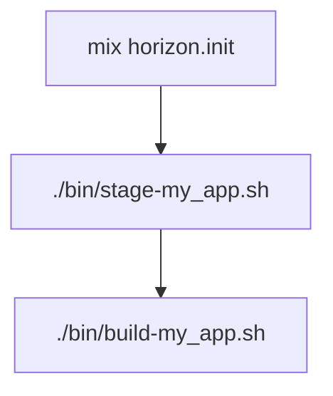

# Horizon

Horizon provides scripts to build and deploy Elixir applications to FreeBSD.
It's intent is simplify the deploy process. Part of the ground work
to have a simple deployment process is to have a simple process
to configure and build web and postgres hosts.

Horizon is a suite of scripts that are used to build and deploy your Elixir
application to a FreeBSD host.

`Horizon` provides tools for host configuration (build, postgresql db, web) and tools to deploy any Elixir app that uses `mix release`. 


## Setup Steps

```shell
mix horizon.init
./bin/stage-my_app.sh
./bin/build-my_app.sh
./bin/deploy-my_app.sh [deploys to build host by default]
./bin/deploy-my_app.sh -h target_host -u target_user my_app-0.1.2.tar.gz
```




ssj 176 "(cd /usr/local/opt/phx_only/build; . ~/.shrc; doas ./bin1/build-phx_only.sh)"

ssj 176 "(cd /usr/local/opt/phx_only/build; PATH=/usr/local/erlang27/bin:$PATH doas ./bin1/build-phx_only.sh)"

## Installation

If [available in Hex](https://hex.pm/docs/publish), the package can be installed
by adding `horizon` to your list of dependencies in `mix.exs`:

```elixir
def deps do
  [
    {:horizon, "~> 0.1.0"}
  ]
end
```

[](https://elixir-lang.org/)
[](LICENSE)

Welcome to **Horizon**, an Elixir project that [briefly describe what Horizon does].


## Table of Contents

- [Introduction](#introduction)
- [Features](#features)
- [Installation](#installation)
  - [Prerequisites](#prerequisites)
  - [Setup](#setup)
- [Usage](#usage)
- [Documentation](#documentation)
- [Contributing](#contributing)
- [License](#license)
- [Acknowledgments](#acknowledgments)

## Introduction

Horizon is a [detailed description of your project]. It aims to [state goals or solve specific problems].

## Features

- **Scalable Architecture**: Built with scalability in mind.
- **High Performance**: Optimized for speed and efficiency.
- **Ease of Use**: Simple APIs and comprehensive documentation.

## Installation

### Prerequisites

- Elixir ~> 1.12
- Erlang/OTP ~> 24
- [Additional prerequisites]

### Setup

1. **Clone the Repository**

## BSD Build File

You can configure

### Configuring a Web Host

### Configuring a Postgres Host


---


Documentation can be generated with [ExDoc](https://github.com/elixir-lang/ex_doc)
and published on [HexDocs](https://hexdocs.pm). Once published, the docs can
be found at <https://hexdocs.pm/horizon>.


