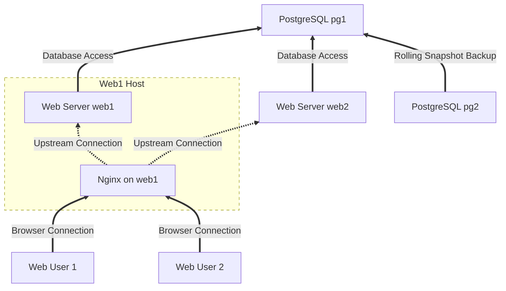

# Deploying with Horizon

This guide walks you through using Horizon to deploy your ElixirPhoenix application to production hosts.

We will cover host configuration and the deployment process to release your web application to production.

> This guide assumes you have hosts with FreeBSD installed, names and/or addresses for those hosts, and passwordless access to the hosts. See the installation resources for more information on setting up your hosts.


## Web Cluster Topology

This guide will walk you through configuring a four server topology.
We will use the names `demo-web1`, `demo-web2`, `demo-build`, and `demo-pg1`, and `demo-pg2` for the web, build, and database hosts respectively.

The application cluster uses `demo-web1` as a web host **and** the `nginx` reverse-proxy.
The `web` hosts `demo-web1` and `demo-web2` are connected to a PostgreSQL database server, `demo-pg1`. 
The `demo-pg1` server is backed up by `demo-pg2` using a rolling snapshot backup strategy.

Finally, the fifth server is `build` host `demo-build` that is used to build the release tarball
that is deployed to the `demo-web1` and `demo-web2` hosts.

The topology is illustrated below.




## Installing Horizon Ops Tools

Horizon has a suite of tools for deploying your Elixir/Phoenix application to a FreeBSD host. These tools are installed with:

```
mix horizon.ops.init
```
The Horizon ops scripts are not specific to your application; therefore, you can install them anywhere on your system.

The default install location is `ops/bin` inside your project, but you may want to install them in `$HOME/bin` so they are more generally available.

```shell
mix horizon.ops.init ~/bin
```

And update your path if needed:
```shell
export PATH=$PATH:~/bin
```

## Naming Hosts and Configuring LAN

If you have just followed the [host instantiation instructions](hetzner-cloud-host-instantiation.html) and created five VMs, you will need to assign host names to each VM and, for convenience, add them to your `/etc/hosts` file.

Define the host names in your `/etc/hosts` file with the public IP addresses of each host.

The IP addresses for our demo project were:

```shell
cat /etc/hosts
...
## Demo
178.156.153.24	demo-build
5.161.249.144	demo-web1
178.156.153.23	demo-web2
178.156.153.21	demo-pg1
178.156.153.22	demo-pg2
```

### Set Hostnames
With host name aliases set, you can set the hostname of each host.

```shell
ssh admin@demo-web1 "doas hostname demo-web1; doas sysrc hostname=demo-web1"
ssh admin@demo-web2 "doas hostname demo-web2; doas sysrc hostname=demo-web2"
ssh admin@demo-pg1 "doas hostname demo-pg1; doas sysrc hostname=demo-pg1"
ssh admin@demo-pg2 "doas hostname demo-pg2; doas sysrc hostname=demo-pg2"
ssh admin@demo-build "doas hostname demo-build; doas sysrc hostname=demo-build"
```

### Configure LAN
Hetzner Cloud VMs are configured with a private network interface on `vtnet1`.
We will configure the `vtnet1` interface on each host to use DHCP.

```shell
ssh admin@demo-web1 "doas sysrc ifconfig_vtnet1=DHCP"
ssh admin@demo-web2 "doas sysrc ifconfig_vtnet1=DHCP"
ssh admin@demo-pg1 "doas sysrc ifconfig_vtnet1=DHCP"
ssh admin@demo-pg2 "doas sysrc ifconfig_vtnet1=DHCP"
ssh admin@demo-build "doas sysrc ifconfig_vtnet1=DHCP"
```

Note that on Hetzner Cloud, the DHCP server assigns a netmask of `0xFFFF`.
This means that there is no LAN in the traditional sense and no `arp` requests.
Instead, traffic sent to a another host on the "LAN" is handled by the gateway router.

This will come into play when configuring the host-based authentication for the database.

```shell
$ netstat -rn
Routing tables

Internet:
Destination        Gateway            Flags     Netif Expire
default            172.31.1.1         UGS      vtnet0
5.161.249.144      link#3             UH          lo0
10.0.0.0/16        10.0.0.1           UGS      vtnet1
10.0.0.1           link#2             UHS      vtnet1
10.0.0.2           link#3             UH          lo0
127.0.0.1          link#3             UH          lo0
```

## Configuring Hosts
Each type of host has different requirements. 
You can use Horizon Ops `bsd_install.sh` and a config file to set up each host according its needs. 
We'll look at each type of host and the configuration needed -- `web`, `postgres`, `postgres-backup`, and `build`.

[Sample configuration files are provided for each host type](sample-host-configurations.html).

### Configure Web Hosts

A web host has minimal configuration because we ship the Erlang runtime in the deployments. This allows you to update the Elixir version on deployments.

For this example, the web host is also running the reverse proxy, we we'll install the `nginx` application, start the `nginx` service and install `certbot` for future certification configuration.

Create a file named `web+proxy.conf` with the following content:

```
pkg:nginx
service:nginx
pkg:py311-certbot
```

and configure your web host with:

```
bsd_install.sh admin@demo-web1 web+proxy.conf
```

If your are horizontally scaling your web app topology with additional web hosts, you only need to install specific applications that they may need. Typically, other web hosts will not need proxies, certificates, or other services.

### Configure Postgres Host

Your postgres host serves as a database for all of the web hosts. 
For performance reasons, you may use a larger cloud server or a dedicated server for your database.

This example installs Postgres on `demo-pg1`.

There are four installation steps we will use to stand up a Postgres database:

1. Install the version of postgres server and contrib library of your choice
2. Configure zfs for database snapshots.
3. Initialize postgres. This configures `postgresql.conf`, `pg_hba.conf` and logging. Logging is at `/var/log/postgresql.log`
4. Create a database. Creating a database creates a user/password, and updates `pg_hba.conf`. You can also choose the locale and `ctype` of the database.

Three postgres encoding options are available:
1. postgres-db-c_mixed_utf8
2. postgres-db-c_utf8_full
3. postgres-db-us_utf8_full

The most common option is `c_mixed_utf8` which sorts with byte order for speed, but encodes with `UTF-8`.
This format, while common, will not sort `UTF-8` characters as desired.

In this example, we install `postgresql17-server` and `postgresql17-contrib` and initialize the database with the `c_mixed_utf8` encoding.
Note that we also initialize `zfs` before initializing the database. 
The `zfs` initialization is required for the backup host to take snapshots of the database.

Create the file `postgres.conf` with:
```
pkg:postgresql17-server
pkg:postgresql17-contrib
postgres.zfs-init
postgres.init

# Encode with UTF8 and sort with byte order
postgres.db:c_mixed_utf8:my_app1_prod
```

and install with:

```
bsd_install.sh admin@demo-pg1 postgres.conf
```

Running this command generated the following output:

```shell
...
CREATE ROLE
[SUCCESS] User 451f8d75-a808-11ef-8e9c-e1aff46a3315 created successfully.
CREATE DATABASE
[SUCCESS] Database my_app1_prod created successfully.
[SUCCESS] Added user 451f8d75-a808-11ef-8e9c-e1aff46a3315@my_app1_prod to pg_hba.conf.
[SUCCESS] Postgres reloaded successfully.
[SUCCESS] Username: 451f8d75-a808-11ef-8e9c-e1aff46a3315
[SUCCESS] Password: 0462ae2ea0e180b4beb0558bf5baec29e87c1ec9bd4f5c6c
[SUCCESS] Database: my_app1_prod
[WARN] Record these credentials in a secure location.
[WARN] You will not be able to retrieve the password later.
```

Save the `username` and `password` in a secure location. You will need them to configure your Elixir/Phoenix application.

### Configure Postgres Backup Host

To configure a backup host, you can use a similar configuration as the Postgres host. The backup host will have the same version of Postgres, but we will not initialize postgres with `postgres.init` nor create a database.

Create the file `#postgres-backup.conf` with:
```
pkg:postgresql17-server
pkg:postgresql17-contrib
postgres.zfs-init
```

and install with:

```
bsd_install.sh admin@demo-pg2 postgres-backup.conf
```

#### Install Backup Scripts and Cron Jobs

To finalize the backup configuration you will need to:
- Copy the `zfs_backup.sh` script to the backup host. This script is used to backup the Postgres database to a ZFS volume.
- Ensure `demo-pg2` had passwordless access to `demo-pg1`.
- Add a crontab to run `zfs_snapshot.sh`

First, copy the `zfs_snapshot.sh` script to the backup host. Remember to copy `zfs_snapshot.sh` from the location where you installed the Horizon ops scripts.

```shell
ssh admin@demo-pg2 "mkdir -p bin"
scp ~/bin/zfs_snapshot.sh admin@demo-pg2:bin
```

You will likely need to add an ssh key to `demo-pg2` and copy its public key to `demo-pg1` and verify passwordless access to `demo-pg1` from `demo-pg2`.

```shell
ssh admin@demo-pg2 "ssh-keygen"
```

```shell
scp admin@demo-pg2:.ssh/id_rsa.pub /tmp
scp /tmp/id_rsa.pub admin@demo-pg1:/tmp
ssh admin@demo-pg1 "cat /tmp/id_rsa.pub >> .ssh/authorized_keys"
```

Before adding the cronjob, log into `demo-pg2` and verify that you can ssh to `demo-pg1` without a password. For this example we added a host to `/etc/hosts` to make it easier to reference the `demo-pg1`.

```terminal
$ tail -1 /etc/hosts
10.0.0.3	pg1
```

This command below assumes `pg1` is in `/etc/hosts` and you can ssh to `admin@pg1` from `demo-pg2` without a password.

```shell
ssh admin@demo-pg2 "CRON_JOB='*/30 * * * * /home/admin/bin/zfs_snapshot.sh admin@pg1 >> /var/log/zfs_snapshot.log 2>&1'; (crontab -l 2>/dev/null | grep -Fq \"\$CRON_JOB\") || (crontab -l 2>/dev/null; echo \"\$CRON_JOB\") | crontab -"
```

#### Verify the Backup

You can verify the backup by connecting to `demo-pg2` and running the backup command:

Running the backup on our demo produced the following output:

```shell
ssh admin@demo-pg2 
bin/zfs_snapshot.sh admin@pg1
zfs list -t snapshot
```

```shell
$ ./bin/zfs_snapshot.sh pg1
Running PostgreSQL backup and creating ZFS snapshot...
 pg_backup_start
-----------------
 0/2000028
(1 row)

ERROR:  backup is not in progress
HINT:  Did you call pg_backup_start()?
PostgreSQL backup and ZFS snapshot completed.
No common snapshot found, or no previous snapshots. Sending full snapshot.
Sending full rolling snapshot zroot/var/db_postgres@rolling-20241121080548 to controlling host...
full send of zroot/var/db_postgres@rolling-20241121080548 estimated size is 13.8M
total estimated size is 13.8M
TIME        SENT   SNAPSHOT zroot/var/db_postgres@rolling-20241121080548
Cleaning up old rolling snapshots...
Not enough snapshots for cleanup. Current count:        1, required: 48
Snapshot process completed.
admin@demo-pg2:~ $ zfs list -t snapshot
NAME                                           USED  AVAIL  REFER  MOUNTPOINT
zroot/ROOT/default@2024-11-19-11:35:22-0       394M      -  2.10G  -
zroot/ROOT/default@initial-setup               500K      -  2.12G  -
zroot/var/db_postgres@rolling-20241121080548    56K      -  14.3M  -
```

> The "ERROR:  backup is not in progress" message is expected since `pg_backup_start` is run at the start of the backup, but a backup was never requested from postgres. Instead, a physical backup via `zfs` is run and this error is generated when `pg_backup_stop` is called.

It's a good idea to also validate that the log file was created and contains the expected output.

```shell
bin/zfs_snapshot.sh admin@pg1 >> /var/log/zfs_snapshot.log
tail /var/log/zfs_snapshot.log
zfs list -t snapshot
```

### Configure Build Host

To prepare a build host, you'll need to install the Erlang runtime and Elixir.
For simplicity, we maintain only one version of each on a `build` host.

We use the latest packaged (pkg) version of Erlang for convenience but build our own version of Elixir.
The build host is responsible for creating the release tarball.

Create a file named `build.conf` with the following content:

```
pkg:ca_root_nss
pkg:gcc
pkg:rsync
pkg:gmake
pkg:git
pkg:erlang-runtime27

# Set the path to erlang so we can install elixir
path:/usr/local/lib/erlang27/bin

elixir:1.17.3
```

To install the necessary packages and configure the host, run:

```
bsd_install.sh admin@demo-build build.conf
```

## Configure Reverse Proxy

To Configure `nginx` we use `Horizon.NginxConfig` module to send the configuration to the proxy host.

In the following example, we configure the `nginx` server to proxy requests to the `my_app1` application running on `demo-web1`. 

```elixir
user="admin"
host="demo-web1"

projects = [
  %Horizon.Project{
    name: "my_app1",
    server_names: ["demo-web1"],
    http_only: true,
    # certificate: :letsencrypt,
    # letsencrypt_domain: "my_app.com",
    servers: [
      # Verify PORT is same as in runtime.exs or env.sh.eex
      %Horizon.Server{internal_ip: "10.0.0.2", port: 4000},
      %Horizon.Server{internal_ip: "10.0.0.5", port: 4000}
    ]
  }
]
Horizon.NginxConfig.send(projects, user, host, action: :restart)
```

If you want to add a second application `my_app2` to the same application cluster, you can add it to the `projects` list and call `Horizon.NginxConfig.send/4` again.

> When running multiple applications on the same host, ensure that the ports are unique for each application.

Here is an example of configuring two applications on the same host.
`my_app1` is deployed with `http_only` and `my_app2` uses a self-signed cert.

```shell
# in my_app2
mix horizon.gen.cert
```

In a Livebook cell, you can run the following code to configure the `nginx` server to proxy requests to the `my_app1` and `my_app2` applications running on `demo-web1` and `demo-web2`.

```elixir
user="admin"
host="demo-web1"

projects = [
  %Horizon.Project{
    name: "my_app1",
    server_names: ["my-app1"],
    http_only: true,
    # certificate: :letsencrypt,
    # letsencrypt_domain: "my_app",
    servers: [
      # Verify PORT is same as in runtime.exs or env.sh.eex
      %Horizon.Server{internal_ip: "127.0.0.1", port: 4000},
      %Horizon.Server{internal_ip: "10.0.0.5", port: 4000}
    ]
  },
  %Horizon.Project{
    name: "my_app2",
    server_names: ["my-app2"],
    certificate: :self,
    servers: [
      # Verify PORT is same as in runtime.exs or env.sh.eex
      %Horizon.Server{internal_ip: "10.0.0.2", port: 5000},
      %Horizon.Server{internal_ip: "10.0.0.5", port: 5000}
    ]
  }
]
Horizon.NginxConfig.send(projects, user, host, action: :restart)
```

If you have open ports on your firewall, you will be able to access each application by the server name and port number when using the `http_only: true` option.

Certificate configuration is covered in the next section.


## Configure Certificates

There are several options to consider when configuring certificates for your web host. 
- no certificates - use http only for testing
- self-signed certificates - use for testing when you don't have a domain name
- acme certificates - per domain certificates
- wildcard certificates - for multiple subdomains. requires DNS configuration

### Self-signed Certificates

You can install self-signed certificates using Horizon's mix task
```shell
mix horizon.gen.cert
```

This will run `mix phx.gen.cert` if no certificates are found in the `priv/cert` directory and will copy the certificates to the `rel/overlays/cert` directory. This will allow you to use the certificates in your release when you don't have a domain name.

#### ACME Certificates

You can generate certificates using `certbot` with the following command on the `demo-web1` host:

```shell
doas certbot certonly \
  --dry-run --webroot \
  --webroot-path /usr/local/my_app1 \
  --rsa-key-size 4096 \
  --email me@example.com \
  --agree-tos \
  --non-interactive \
   -d my_app1.com
```

Remove the `--dry-run` option to generate a real certificate.

#### Wildcard Certificates

If you have multiple subdomains, you can use a wildcard certificate.
`certbot` supports multiple DNS providers to automate the process.

On the `demo-web1` host, you can get a list of the supported providers:

```shell
 $ pkg search certbot
py311-certbot-2.11.0,1         Let's Encrypt client
py311-certbot-apache-2.11.0    Apache plugin for Certbot
py311-certbot-dns-cloudflare-2.11.0_1 Cloudflare DNS plugin for Certbot
py311-certbot-dns-cpanel-0.4.0 CPanel DNS Authenticator plugin for Certbot
py311-certbot-dns-digitalocean-2.11.0 DigitalOcean DNS Authenticator plugin for Certbot
py311-certbot-dns-dnsimple-2.11.0 DNSimple DNS Authenticator plugin for Certbot
py311-certbot-dns-dnsmadeeasy-2.11.0 DNS Made Easy DNS Authenticator plugin for Certbot
py311-certbot-dns-gandi-1.5.0  Gandi LiveDNS plugin for Certbot
py311-certbot-dns-gehirn-2.11.0 Gehirn Infrastructure Service DNS Authenticator plugin for Certbot
py311-certbot-dns-google-2.11.0 Google Cloud DNS Authenticator plugin for Certbot
py311-certbot-dns-linode-2.11.0 Linode DNS Authenticator plugin for Certbot
py311-certbot-dns-luadns-2.11.0 LuaDNS Authenticator plugin for Certbot
py311-certbot-dns-nsone-2.11.0 NS1 DNS Authenticator plugin for Certbot
py311-certbot-dns-ovh-2.11.0   OVH DNS Authenticator plugin for Certbot
py311-certbot-dns-powerdns-0.2.1_1 PowerDNS DNS Authenticator plugin for Certbot
py311-certbot-dns-rfc2136-2.11.0 RFC 2136 DNS Authenticator plugin for Certbot
py311-certbot-dns-route53-2.11.0 Route53 DNS Authenticator plugin for Certbot
py311-certbot-dns-sakuracloud-2.11.0 Sakura Cloud DNS Authenticator plugin for Certbot
py311-certbot-dns-standalone-1.1 Standalone DNS Authenticator plugin for Certbot
py311-certbot-nginx-2.11.0     NGINX plugin for Certbot
```

Using DNSimple as an example and following their instructions, I created a secrets folder and added an API token:

```shell
mkdir -p ~/.secrets/certbot
echo "dns_dnsimple_token = YOUR_DNSIMPLE_API_TOKEN" >> ~/.secrets/certbot/dnsimple.ini
chmod 600 ~/.secrets/certbot/dnsimple.ini
```

Then I ran the following command to generate a wildcard certificate:

```shell
  doas certbot certonly \
  --dns-dnsimple \
  --dns-dnsimple-credentials ~/.secrets/certbot/dnsimple.ini \
  --dns-dnsimple-propagation-seconds 60 \
  --non-interactive \
  --agree-tos \
  --email me@example.com \
  -d "example.com" -d "*.example.com"
```

#### Updating Nginx Configuration with Certificates

When you have your certificates, you can update the `nginx` configuration to use them.

If you are using standard Let's Encrypt certificates, you can simplify configuration by providing the domain name and the certificate type:
```elixir
iex> projects =[%Horizon.Project{
    name: "my_app1",
    server_names: ["demo-web1"],
    certificate: :letsencrypt,
    letsencrypt_domain: "example.com",
    #acme_challenge_path: "custom_path",
    servers: [
      # Verify PORT is same as in runtime.exs or env.sh.eex
      %Horizon.Server{internal_ip: "127.0.0.1", port: 4000},
      %Horizon.Server{internal_ip: "10.0.0.5", port: 4000}
    ]
  }]
  Horizon.NginxConfig.send(projects, user, host, action: :restart)
```

You can also specify the path to the acme challenge if you have a custom path by setting the `acme_challenge_path` explicitly.

#### Renewing Certificates

Letsencrypt certificates have a lifespan of 90 days and therefore need to be renewed on a periodic basis.

Certificate renewal is done with `certbot renew`. You can use the Horizon script `add_certbot_crontab.sh` to schedule a cron job to check twice daily if certificates need to be renewed. If the certificates are due for renewal, the cron job will renew them and reload the `nginx` service.

Run this script to add a cron job to `demo-web1`:

```shell
$ bin/add_certbot_crontab.sh admin@demo-web1
Cron job added successfully.
```

This script will add a cron job that looks like this:

```shell
0 0,12 * * * /usr/local/bin/doas /usr/local/bin/certbot renew --quiet --post-hook "/usr/local/bin/doas /usr/sbin/service nginx reload"
```


## Deploying a Release

The configuration and install steps described above are run infrequently; usually when versions change or servers are added. 
The majority of the work in a new deployment is the setup; with that out of the way, you can now build and release your Elixir application into the wild.

The `stage`, `build`, and `deploy` tasks are the most frequently executed tasks as they are required for each release. Let's look at each step:

- Staging copies the app source to the build machine.
- Building creates a tarball that is ready to run on a deploy host.
- Deploy copies the tarball to the build machine and starts the service. (Future: JEDI can allow hot deploys to a running service.)

To install these scripts for our application, we run:
```shell
mix horizon.init
```

Assuming you have used the default `bin` folder for your project, you should see the following scripts for `my_app1` generated in `bin/`:

```shell
$ ls -F bin
build-my_app1.sh*         deploy-my_app1.sh*        horizon_helpers.sh
build_script-my_app1.sh*  deploy_script-my_app1.sh  stage-my_app1.sh*
```

### Stage and Build

Before deploying an app we must stage it to the build server and build the app.
The `stage` and `build` steps look like:

```shell
# transfer existing code state to build server
# (use --force to stage code that is not committed)
./bin/stage-my_app.sh --force

# build your app on the build server and 
# copy the tarball to .releases/
./bin/build-my_app.sh
```
In this example, we are using the `--force` option to copy the code to the build server even if it is not committed. 

The `build` step places a tarball in the `.releases` directory. This tarball is ready to be deployed to the production host.

### Deploy

The `deploy` step is the final step in the release process.
It copies the tarball to the production hosts defined in `releases` in `mix.exs`, extracts the tarball, and (re)starts the service.

```shell
# deploy the release
./bin/deploy-my_app.sh
```

These steps can be combined into a single command:

```shell
./bin/stage-my_app.sh --force && ./bin/build-my_app.sh && ./bin/deploy-my_app.sh
```

If successful, your application will be running on the production hosts and you can access it via the domain name or IP address of the host.

### Release Steps Summary

Here is a summary of the actions taken in each release step.

#### Stage
- Uses `rsync` or `tar/scp` to copy the current project state to the build host
#### Build
- checks if `tailwind` is available and downloads it if needed.
- installs `mix local.hex`
- runs `mix deps.get`
- runs `mix assets.setup.freebsd`
- runs `mix phx.digest.clean --all`
- runs `mix assets.deploy`
- runs `mix release`
  - Calls `Horizon.Ops.BSD.Step.setup/1` that creates the rcd script
- stores the tarball in .releases
- stores the tarball name in `.releases/my_app.data`
#### Deploy

- adds `my_app_enable="YES"` to `/etc/rc.conf`
- expands the tarball
- sets `env.sh` to mode 0400.
- creates user 'my_app1' (name of your app) if it doesn't exist
- moves rcd script to `/usr/local/etc/rc.d/my_app1`
- runs any optional release commands
- runs `doas service my_app1 restart`

Apps are started with the user that has the same name as the app.
For example, the release `my_app1` will be run as the user `my_app1`.
This allows multiple Elixir/Phoenix apps to reside on the same
server, each isolated from the other and individually controlled
with the `service` command.

## Example Release for `MyApp1`

Assuming you have the previously described hosts configured and running, here are the steps to deploy `MyApp1` to `demo-web1` and `demo-web2`.


With server
- mix phx.new my_app1
- cd my_app1
- mix ecto.create
- psql -d my_app1_prod -U 451f8d75-a808-11ef-8e9c-e1aff46a3315 -h demo-pg1
- Configure `mix.exs`
- mix horizon.init
- ./bin/stage-my_app1.sh --force && ./bin/build-my_app1.sh && ./bin/deploy-my_app1.sh
- configure nginx `http_only`
- browse to http://demo-web1

> [Horizon provides scripts to backup an existing postgres database and restore it to the new database](horizon-helper-scripts.html#transferring-databases).
```elixir
  def project do
    [
      app: :my_app1,
      ...
      releases: [
        my_app1: [
          include_executables_for: [:unix],
          steps: [&Horizon.Ops.BSD.Step.setup/1, :assemble, :tar],
          build_host_ssh: "admin@demo-build",
          deploy_hosts_ssh: ["admin@demo-web1", "admin@demo-web2]
        ],
      ]
    ]
  end
```

## Running Phoenix Apps on FreeBSD

Running `mix release` generates a `script` that is used to start and stop your application. This is a script and not a binary executable. The name of the application binary that gets launched is `beam.smp` with a full path of `/usr/local/my_app/erts-<version>/bin/beam.smp`.

This is a problem for FreeBSD as it uses the `pid` and the name of the app when searching for a service to stop. For this reason, if you use the default release scripts to `start` and `stop` your app, it will time out when stopping the app.

`Horizon` fixes this by creating a run command file in `/usr/local/etc/rc.d/my_app`. On FreeBSD, you can still use the default scripts:

```
# Ok to use remote|rpc|eval
/usr/local/my_app/bin/my_app remote|rpc|eval
```

for running **`remote`**, **`rpc`**, or **`eval`**, but for starting/stopping the service, you should use:

```shell
# service my_app start|stop|restart|status
```

> If you have an existing `rc_d` script and want to fix it for FreeBSD, simply add `procname="*beam.smp"` to the script. This will allow FreeBSD to find the service and stop it correctly.

The command usage for the default app is:

```
Usage: my_app COMMAND [ARGS]

The known commands are:

  start          Starts the system
  start_iex      Starts the system with IEx attached
  daemon         Starts the system as a daemon
  daemon_iex     Starts the system as a daemon with IEx attached
  eval "EXPR"    Executes the given expression on a new, non-booted system
  rpc "EXPR"     Executes the given expression remotely on the running system
  remote         Connects to the running system via a remote shell
  restart        Restarts the running system via a remote command
  stop           Stops the running system via a remote command
  pid            Prints the operating system PID of the running system via a remote command
  version        Prints the release name and version to be booted
```


---


