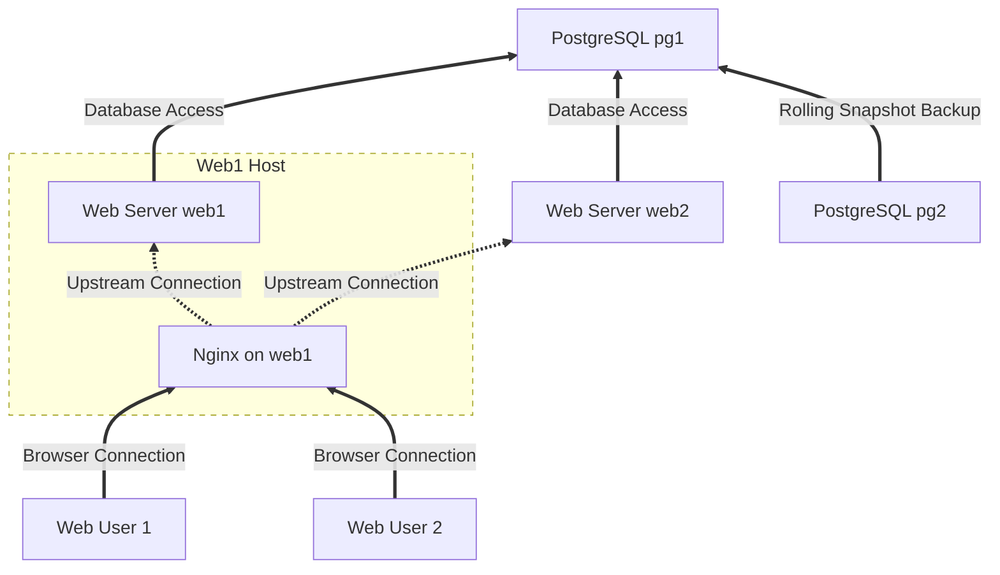

# Web App Topology with Horizontal Scalability

This figure shows a web server cluster with load balancing.
It is built with four servers that can be expanded to include additional web hosts or service hosts.

This starter topology uses `web1` as a web host and the primary `nginx` proxy. The `web` hosts are connected to a PostgreSQL database server, `pg1`. The `pg1` server is backed up by `pg2` using a rolling snapshot backup strategy.

