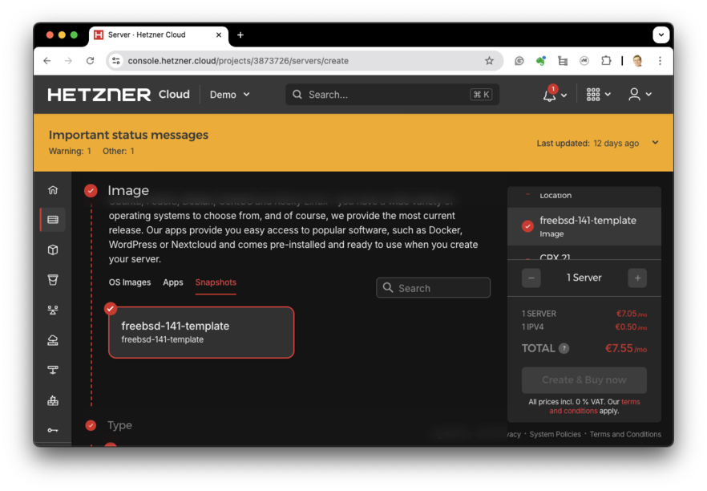
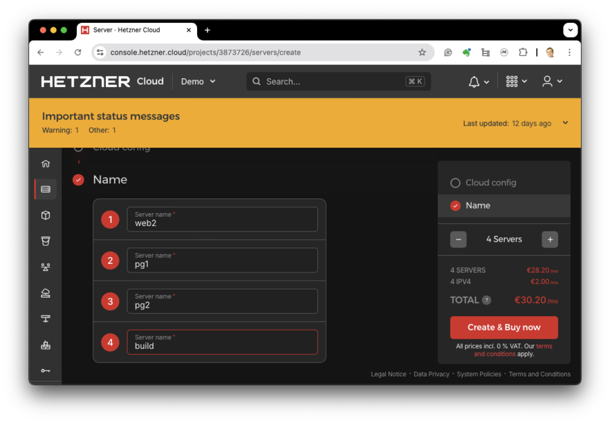
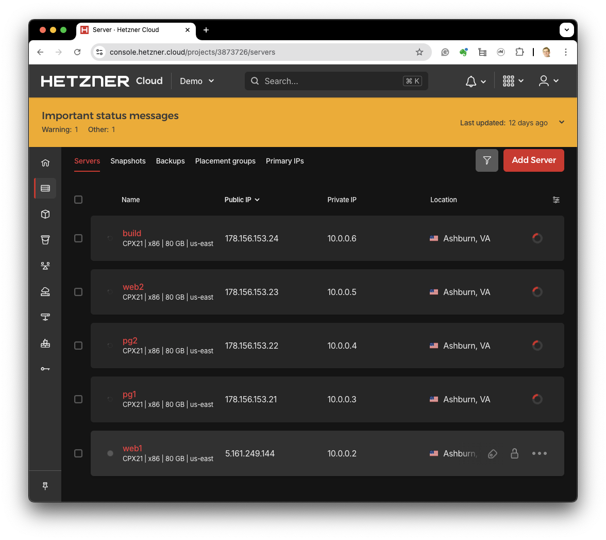

# Hetzner Cloud Host Instantiation

This guide covers creating multiple hosts from a template on Hetzner Cloud to create
a horizontally scalable infrastructure.

## Select a host Image
In the Image section, click on the `Snapshots` tab and select the snapshot you created in the previous guide.

## Name the Hosts
For the scalable infrastructure, we'll create multiple hosts from the snapshot.
Add four servers to the list and name them `web2`, `pg1`, `pg2`, and `build`.

## Create the Hosts
Create the hosts and note the IP addresses, both public and private.

