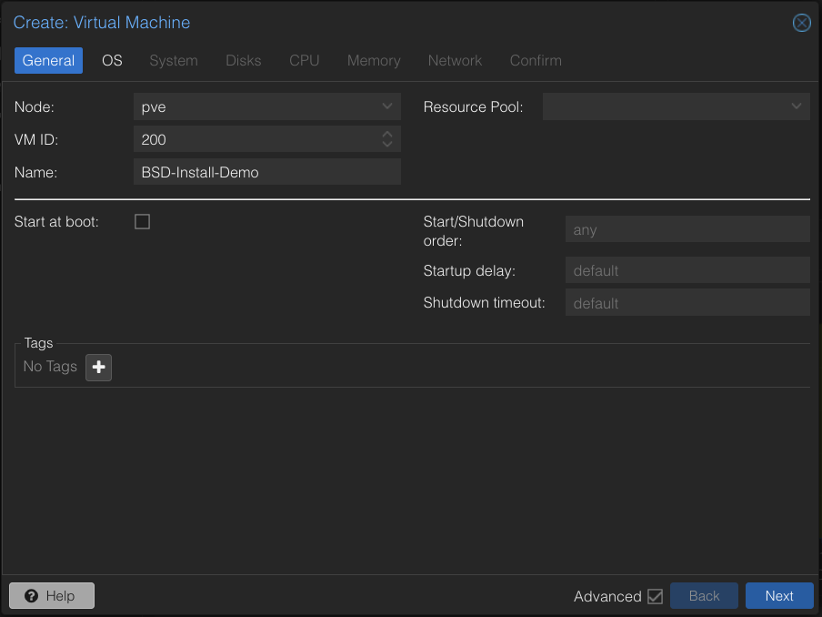
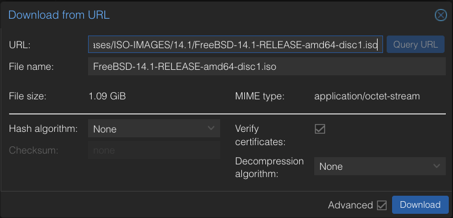
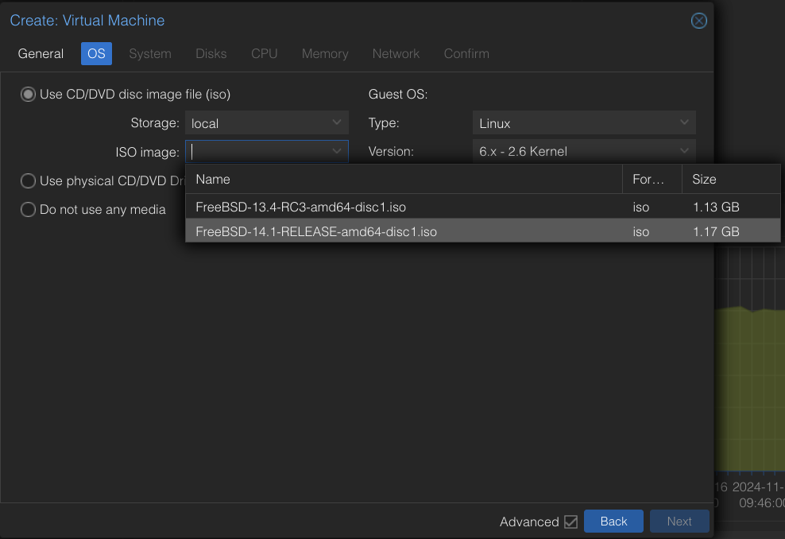
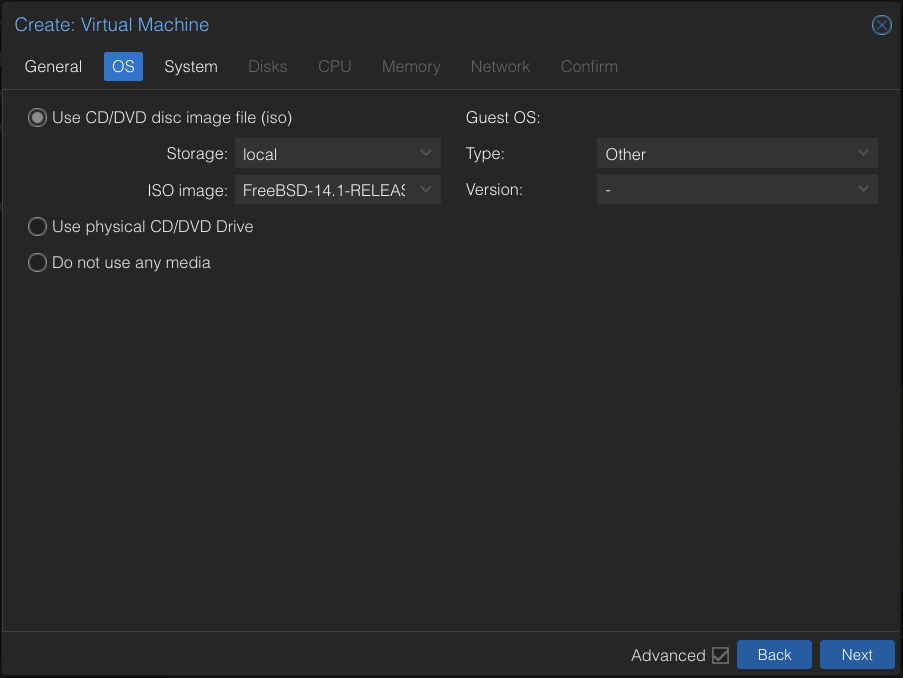
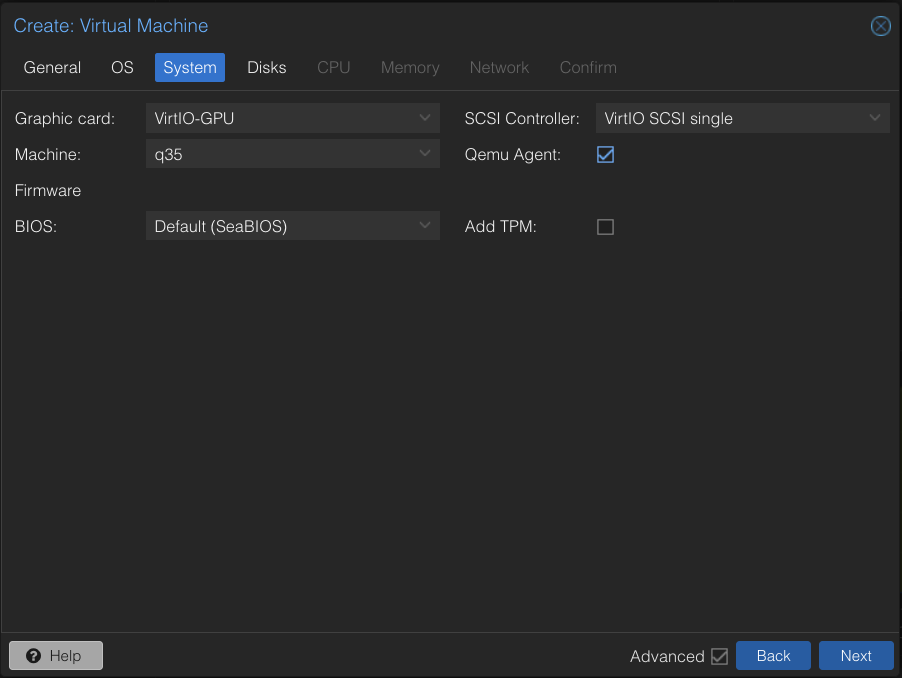
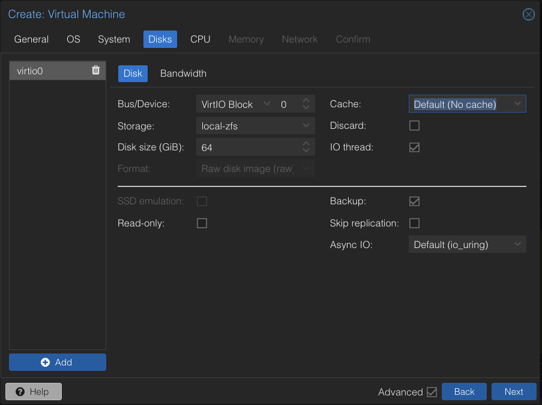
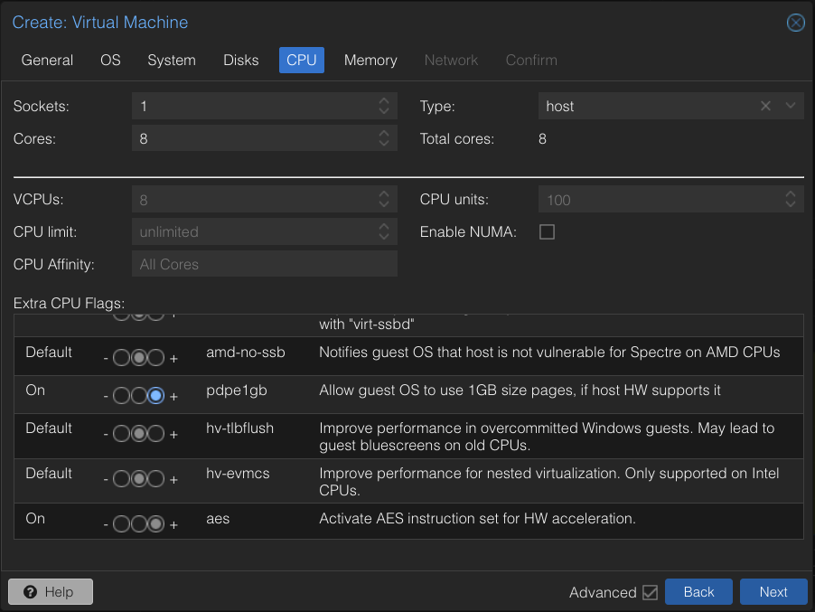
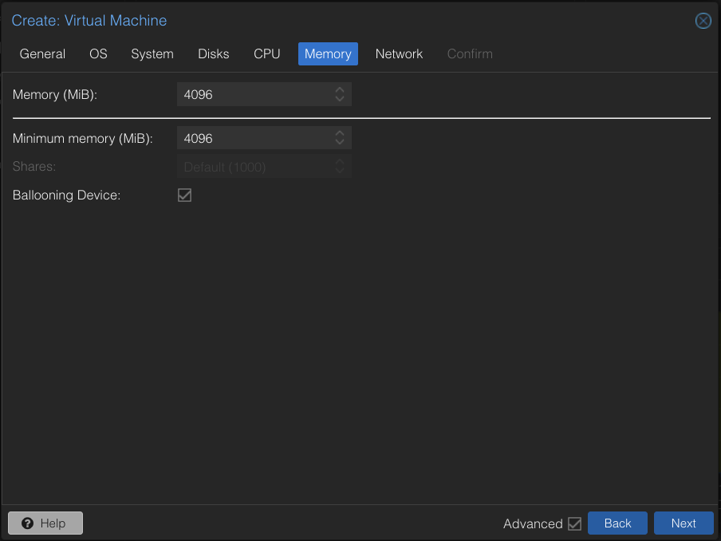
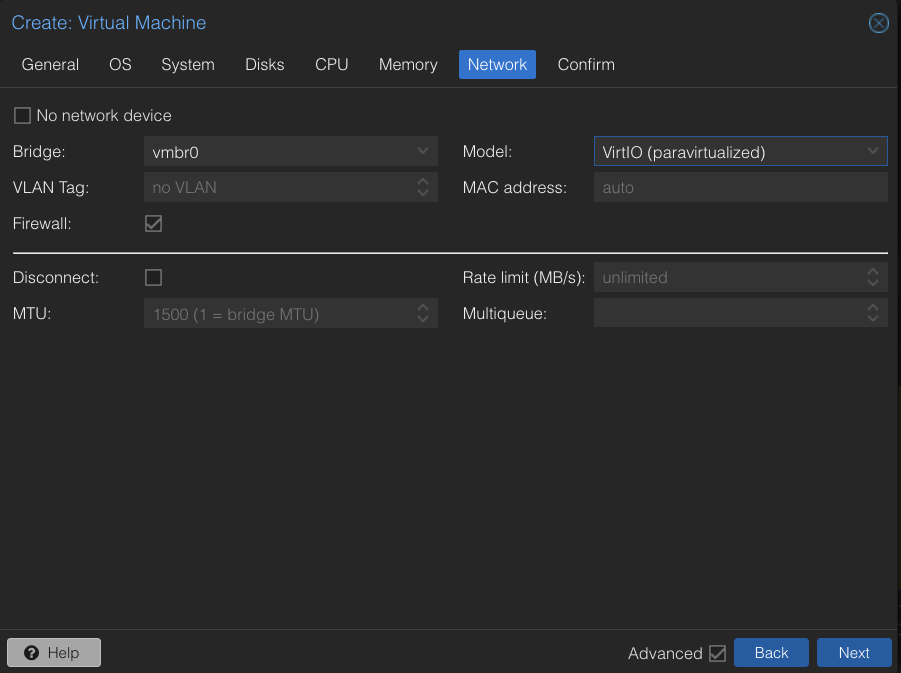
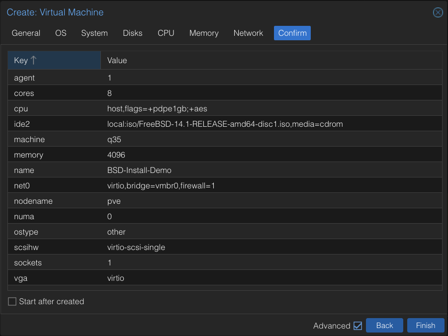

# Building FreeBSD VMs in Proxmox

An example configuration to create a VM for FreeBSD in Proxmox.

This guide is not intended to be a tutorial for Proxmox, but rather a reference for creating a VM for FreeBSD on Proxmox.

## Name Your Virtual Machine


## Select the ISO

If not already added, you can add a FreeBSD ISO by clicking on a host under the Datacenter (`pve` by default) and selecting `local` and then `Download from URL` to add an `ISO Image`.
FreeBSD ISO's can be found at [FreeBSD ISO Images](https://download.freebsd.org/ftp/releases/ISO-IMAGES/).


Pasting the 14.1 link `https://download.freebsd.org/ftp/releases/ISO-IMAGES/14.1/FreeBSD-14.1-RELEASE-amd64-disc1.iso` into the URL section and clicking Query URL will validate the link to the ISO.


Back at your VM creation, select the ISO you just added.


## Set the OS Type

Set the OS type to "other".



## System Configuration

Set the Graphics card to `VirtIO-GPU` and the Machine to `q35`.
Optionally enable the `Qemu Agent`.



## Disk Configuration

Use the `VirtIO Block` for the `Bus/Device`.


## CPU Configuration

Select the number of CPU's you want to allocate to the VM.
Enable `AES` instruction set and 1GB page sizes.



## Allocate Memory


## Network Configuration

Use the `VirtIO (paravirtualized)` network card.


## Confirm


## Proxmox Configuration File

Below is the resulting config file for this example FreeBSD VM configuration in Proxmox.
```
agent: 1
boot: order=virtio0;ide2;net0
cores: 8
cpu: host,flags=+pdpe1gb;+aes
ide2: local:iso/FreeBSD-14.1-RELEASE-amd64-disc1.iso,media=cdrom,size=1146374K
machine: q35
memory: 4096
meta: creation-qemu=8.1.5,ctime=1731773520
name: BSD-Install-Demo
net0: virtio=BC:24:11:61:1F:96,bridge=vmbr0,firewall=1
numa: 0
ostype: other
scsihw: virtio-scsi-single
smbios1: uuid=0be523c5-e87b-4120-a07b-a9d3493491d9
sockets: 1
vga: virtio
virtio0: local-zfs:vm-200-disk-0,iothread=1,size=64G
vmgenid: dfd5e6ba-dd39-44d9-8f0e-216b5700579f
```